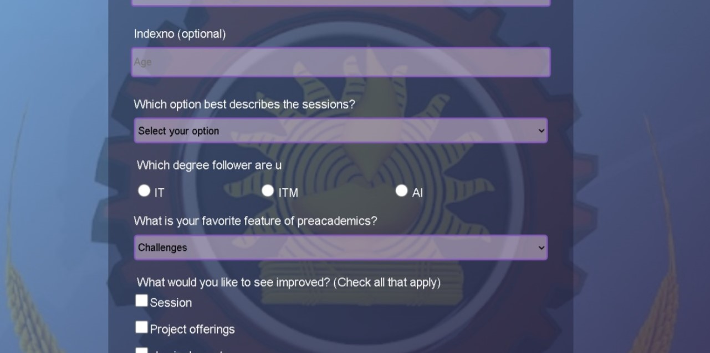
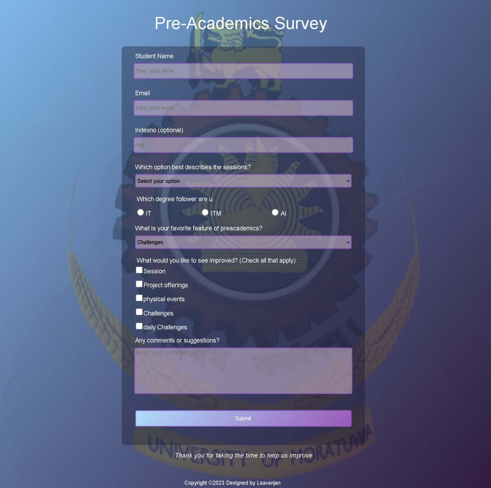

# Pre-Academics Survey Form

📝 This repository contains a pre-academics survey form designed to collect valuable information from participants. The form incorporates a variety of interactive elements such as textboxes, radio buttons, checkboxes, textarea, and selection fields to ensure comprehensive data gathering.

## Table of Contents
- [Preview](#preview)
- [Demo](#demo)
- [Project Description](#project-description)
- [Contributing](#contributing)
- [License](#license)
- [Acknowledgments](#acknowledgments)

## Preview

Here are two screenshots showcasing the design and layout of the survey form:

*Screenshot 1: An example section of the Pre-Academics Survey Form.*

*Screenshot 2: Another section of the Pre-Academics Survey Form.*

## Demo

To experience the form firsthand, you can access the live demo by following this https://baby-laala.github.io/Survey-form-2/.

## Project Description

📚 The Pre-Academics Survey Form is an essential tool designed to gather critical information from participants in order to assess their pre-academic knowledge and skills. By utilizing various input fields and interactive components, the form enables participants to provide detailed responses that contribute to a comprehensive understanding of their capabilities.

🔑 Key Features:
- **Textboxes:** These input fields allow participants to enter text-based responses, such as their name, age, and contact information, providing crucial personal details for further analysis.
- **Radio Buttons:** Participants can choose a single option from a predefined set of choices using radio buttons. This feature aids in gathering specific information in a concise manner.
- **Checkboxes:** With checkboxes, participants can select multiple options from a predefined list, allowing for the collection of diverse responses and preferences.
- **Textarea:** This input field offers participants the opportunity to provide detailed, open-ended responses to questions or prompts, encouraging thoughtful and elaborate insights.
- **Selection Field:** Participants can choose a single option from a dropdown list, which is particularly useful for gathering specific information or preferences in a compact format.

✨ The Pre-Academics Survey Form is designed to be user-friendly, intuitive, and visually appealing. It aims to provide an efficient and enjoyable experience for participants while ensuring that valuable data is collected accurately.

## Contributing

🤝 Contributions are welcome! If you have any suggestions, improvements, or bug fixes, please feel free to open an issue or submit a pull request. Together, we can enhance the functionality and usability of the Pre-Academics Survey Form.

## License

📜 This project is licensed under the [MIT License](LICENSE.md). Feel free to use, modify, and distribute the code as per the terms of the license.

## Acknowledgments

🙏 We would like to express our gratitude to the open-source community for providing invaluable resources and inspiration for this project. Additionally, we extend our thanks to all the contributors who have made this form possible.

🌟 We hope you find the Pre-Academics Survey Form useful and engaging! Thank you for your interest and support.

---

